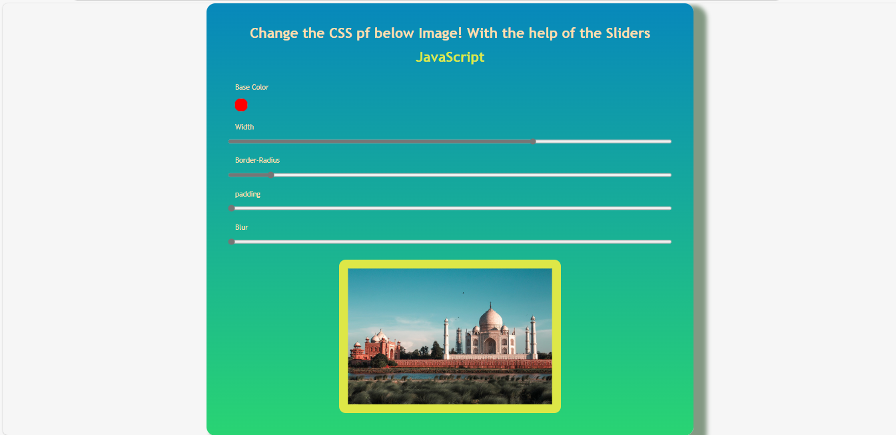
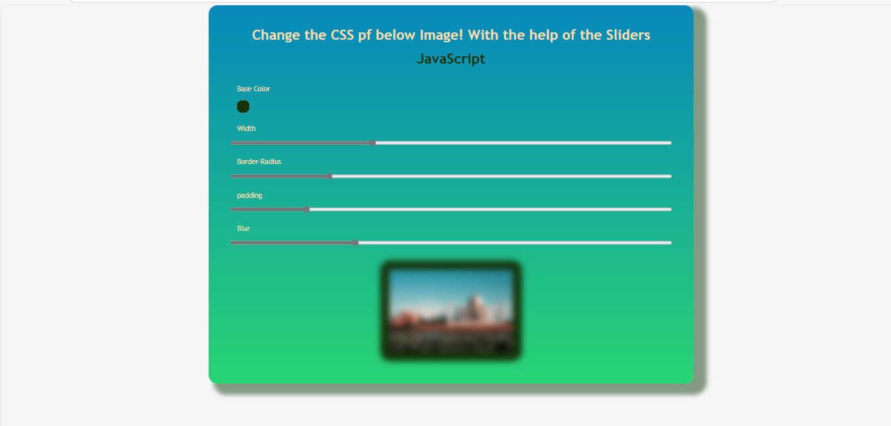

# 🎨 CSS Image Styler with JavaScript

This is a fun and interactive project that allows users to dynamically change the CSS properties of an image using sliders and a color picker. The changes include width, border-radius, padding, blur, and base color.

## 🔗 Live Project

Check out the live version here: [View Live](https://msdhinesh45.github.io/Css-changer/)

## 📸 Output Screenshots

## ✨ Features

- Change image width using a range input.
- Adjust border-radius, padding, and blur in real-time.
- Pick a custom base color using the color input.
- Smooth and instant preview of style changes.

## 🛠️ Technologies Used

- HTML
- CSS
- JavaScript (Vanilla)

## 🚀 How It Works

- The `input` elements inside `.css-controller` listen for changes.
- When any input changes, the `update()` function runs.
- It dynamically updates the CSS custom properties (`--base`, `--width`, etc.) on the root element using `style.setProperty()`.
- The image uses these custom properties to reflect style changes immediately.

## 🧠 Learning Purpose

This project is ideal for beginners learning:
- JavaScript event handling
- Working with CSS variables in JavaScript
- DOM manipulation
- Real-time UI updates

---

Feel free to try out the project and explore how changing sliders updates the image styling dynamically!
